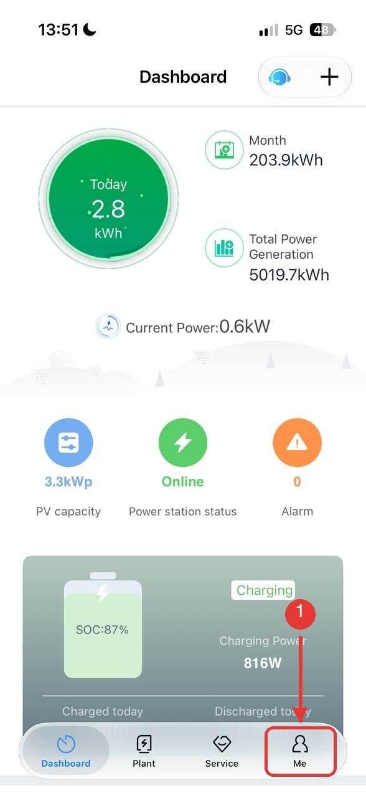
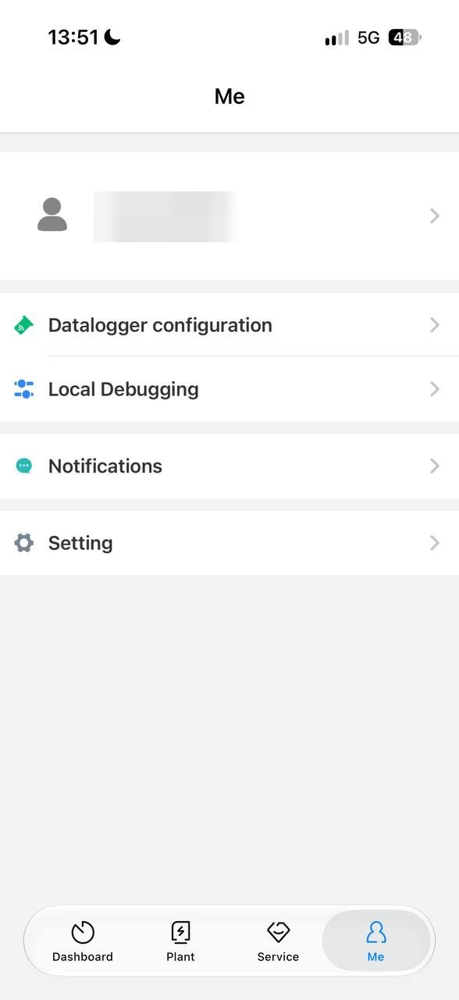
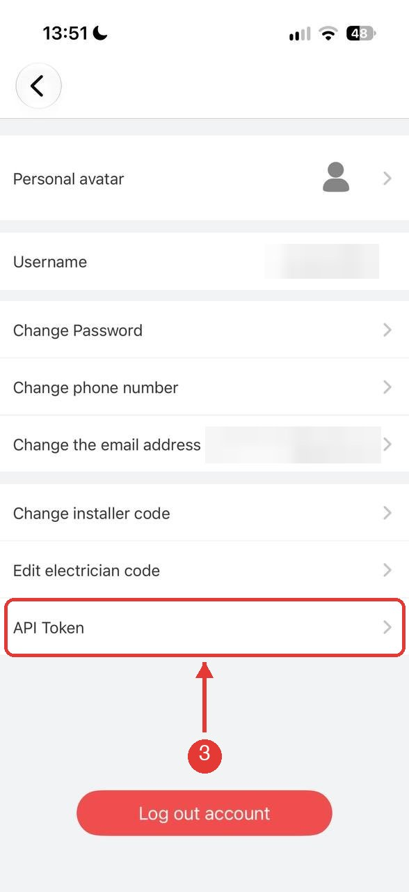
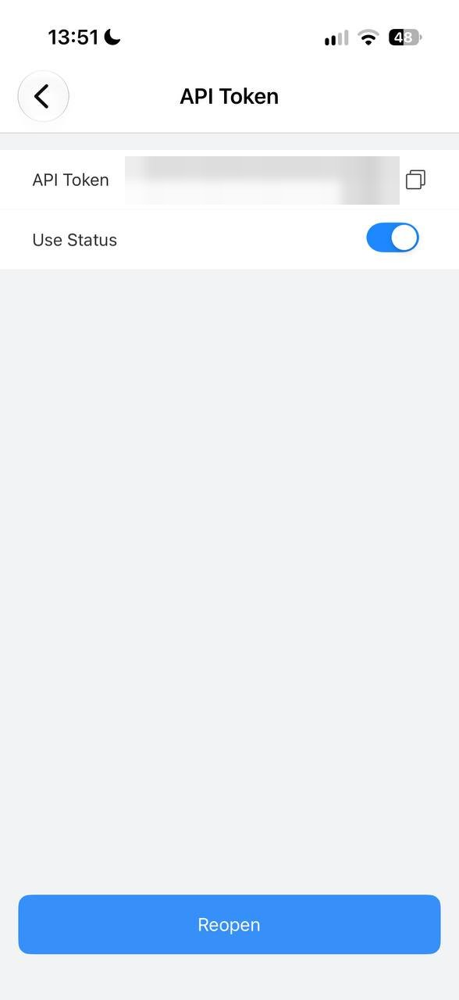

# Growatt MCP Server

[](https://github.com/ratoshniuk/growatt-mcp-server/actions/workflows/ci.yml)

An [MCP](https://modelcontextprotocol.io) server that lets AI assistants (Claude Code, Claude Desktop, Cursor, and any other MCP client) read and control your Growatt solar installation through the official Growatt ShineServer Public API.

You can ask things like "how much did my panels generate today?", "what is the battery SOC?", "compare today with yesterday", or "set the discharge cut-off to 15%", and the assistant will call the right API for you.

## What it can do

| Tool | Description |
|---|---|
| `get_plants` | List plants (installations) on your account |
| `get_plant_details` | Basic info about a plant |
| `get_plant_data` | Today's / monthly / yearly / total energy and current power for a plant |
| `get_plant_energy` | Daily, monthly or yearly energy history (max 7 days per request) |
| `get_devices` | List devices (inverters, dataloggers) for a plant or the whole account |
| `get_device_info` | Device details |
| `get_device_last_data` | Latest real-time readings: PV power, load, grid import/export, battery SOC, temperatures, faults |
| `get_device_history` | 5-minute readings for a single device for one day |
| `check_device_sn` | Look up a serial number |
| `set_device_on_off` | Turn a device on or off |
| `set_device_power` | Set active power limit |
| `read_device_parameter` | Read a VPP parameter (e.g. discharge cut-off SOC) |
| `set_device_parameter` | Write a VPP parameter |

The last four tools change the state of your inverter. Only enable them for an assistant you trust, and review what it is about to do before confirming.

## Requirements

- Python 3.11 or newer
- [uv](https://docs.astral.sh/uv/) (recommended) or pip
- A Growatt account with at least one plant, and an API token

## Getting a Growatt API token

The token is issued in the **ShinePhone** mobile app (the same app you use to monitor the plant). No developer registration is needed.

1. Open ShinePhone, log in with your Growatt account and tap **Me** in the bottom bar.
2. On the **Me** screen, tap your username at the top.
3. In the profile, tap **API Token** (last row).
4. Tap the copy icon next to the token value.
5. Make sure **Use Status** is switched on, otherwise the API rejects the token.

| Step 1 | Step 2 | Step 3 | Steps 4–5 |
|---|---|---|---|
|  |  |  |  |

Keep the token private: it grants full read and write access to your installation, including inverter settings. If it leaks, open the same screen and tap **Reopen** to issue a new one.

## Installation

```bash
git clone https://github.com/ratoshniuk/growatt-mcp-server.git growatt-mcp
cd growatt-mcp
uv sync
```

Quick check that the server starts (it speaks MCP over stdio, so it will wait for input; press Ctrl+C to exit):

```bash
GROWATT_TOKEN=your_token uv run growatt-mcp
```

If the token is missing the server exits with an error explaining where to get one.

Without uv:

```bash
python -m venv .venv
source .venv/bin/activate
pip install -e .
GROWATT_TOKEN=your_token growatt-mcp
```

## Connecting to an MCP client

The server speaks MCP over stdio, so it works with any MCP-capable client. There are two ways to launch it:

- **From a local clone** (recommended if you want to edit the code):
  `uv --directory /absolute/path/to/growatt-mcp run growatt-mcp`
- **Straight from GitHub, no clone** (uvx downloads and caches it):
  `uvx --from git+https://github.com/ratoshniuk/growatt-mcp-server growatt-mcp`

The examples below use the local-clone form. To use the no-clone form, replace `"command": "uv"` with `"command": "uvx"` and the args with `["--from", "git+https://github.com/ratoshniuk/growatt-mcp-server", "growatt-mcp"]`. Some GUI clients don't inherit your shell `PATH`; if the server fails to start, use the full path from `which uv` or `which uvx`.

Restart the client after saving its configuration.

### Claude Code

```bash
claude mcp add growatt \
  -e GROWATT_TOKEN=your_token \
  -- uv --directory /absolute/path/to/growatt-mcp run growatt-mcp
```

Add `-s user` to make it available in every project instead of only the current one.

### Claude Desktop

Edit `claude_desktop_config.json` (macOS: `~/Library/Application Support/Claude/`, Windows: `%APPDATA%\Claude\`):

```json
{
  "mcpServers": {
    "growatt": {
      "command": "uv",
      "args": ["--directory", "/absolute/path/to/growatt-mcp", "run", "growatt-mcp"],
      "env": {
        "GROWATT_TOKEN": "your_token"
      }
    }
  }
}
```

### Cursor

Settings → MCP → Add new global MCP server, or edit `~/.cursor/mcp.json` (global) or `.cursor/mcp.json` (per project). Same format as Claude Desktop:

```json
{
  "mcpServers": {
    "growatt": {
      "command": "uv",
      "args": ["--directory", "/absolute/path/to/growatt-mcp", "run", "growatt-mcp"],
      "env": { "GROWATT_TOKEN": "your_token" }
    }
  }
}
```

### VS Code (GitHub Copilot agent mode)

Create `.vscode/mcp.json` in your workspace, or run **MCP: Add Server** from the command palette. VS Code can prompt for the token so it is not stored in plain text:

```json
{
  "inputs": [
    { "id": "growatt-token", "type": "promptString", "description": "Growatt API token", "password": true }
  ],
  "servers": {
    "growatt": {
      "type": "stdio",
      "command": "uv",
      "args": ["--directory", "/absolute/path/to/growatt-mcp", "run", "growatt-mcp"],
      "env": { "GROWATT_TOKEN": "${input:growatt-token}" }
    }
  }
}
```

### Windsurf

Edit `~/.codeium/windsurf/mcp_config.json` (or Settings → Cascade → MCP Servers → Manage):

```json
{
  "mcpServers": {
    "growatt": {
      "command": "uv",
      "args": ["--directory", "/absolute/path/to/growatt-mcp", "run", "growatt-mcp"],
      "env": { "GROWATT_TOKEN": "your_token" }
    }
  }
}
```

### Cline (VS Code extension)

Open the MCP Servers panel → Configure MCP Servers, which opens `cline_mcp_settings.json`:

```json
{
  "mcpServers": {
    "growatt": {
      "command": "uv",
      "args": ["--directory", "/absolute/path/to/growatt-mcp", "run", "growatt-mcp"],
      "env": { "GROWATT_TOKEN": "your_token" },
      "disabled": false
    }
  }
}
```

### Zed

Add to `~/.config/zed/settings.json`:

```json
{
  "context_servers": {
    "growatt": {
      "source": "custom",
      "command": "uv",
      "args": ["--directory", "/absolute/path/to/growatt-mcp", "run", "growatt-mcp"],
      "env": { "GROWATT_TOKEN": "your_token" }
    }
  }
}
```

### OpenAI Codex CLI

Codex uses TOML. Add to `~/.codex/config.toml`:

```toml
[mcp_servers.growatt]
command = "uv"
args = ["--directory", "/absolute/path/to/growatt-mcp", "run", "growatt-mcp"]
env = { GROWATT_TOKEN = "your_token" }
```

### Gemini CLI

Add to `~/.gemini/settings.json`:

```json
{
  "mcpServers": {
    "growatt": {
      "command": "uv",
      "args": ["--directory", "/absolute/path/to/growatt-mcp", "run", "growatt-mcp"],
      "env": { "GROWATT_TOKEN": "your_token" }
    }
  }
}
```

### OpenCode

This repository ships an `opencode.json`, so launching `opencode` from a clone picks the server up automatically. It reads the token from the `GROWATT_TOKEN` environment variable. For a global setup, add the same block to `~/.config/opencode/opencode.json`:

```json
{
  "mcp": {
    "growatt": {
      "type": "local",
      "command": ["uv", "--directory", "/absolute/path/to/growatt-mcp", "run", "growatt-mcp"],
      "environment": { "GROWATT_TOKEN": "your_token" }
    }
  }
}
```

### Continue

Add to `~/.continue/config.yaml`:

```yaml
mcpServers:
  - name: growatt
    command: uv
    args: ["--directory", "/absolute/path/to/growatt-mcp", "run", "growatt-mcp"]
    env:
      GROWATT_TOKEN: your_token
```

### Any other client, or testing without a client

Point the client at the stdio command above. To poke at the tools interactively, use the MCP Inspector:

```bash
GROWATT_TOKEN=your_token npx @modelcontextprotocol/inspector \
  uv --directory /absolute/path/to/growatt-mcp run growatt-mcp
```

## Configuration

| Variable | Required | Default | Description |
|---|---|---|---|
| `GROWATT_TOKEN` | yes | | ShinePhone API token |
| `GROWATT_BASE_URL` | no | `https://openapi.growatt.com` | Override for regional API hosts, e.g. `https://openapi-us.growatt.com` |

## Example prompts

- "List my plants and show today's generation."
- "Get the latest data from inverter YOUR_DEVICE_SN (type `min`) and tell me the battery SOC and grid import."
- "Fetch the 5-minute history for today and yesterday and compare hourly PV, load and battery charge."
- "Read `set_param_23` on my inverter." (discharge cut-off SOC)

## Notes and gotchas

- **Device types.** Most tools need a `device_type` such as `min`, `sph`, `spa`, `max`, `inv`, `wit`, `tlx`. `get_devices` returns the right value for each device.
- **Timestamps in history data.** The `calendar` field is a Unix epoch built from the plant's local wall-clock interpreted as UTC+8. To get local time, treat the epoch as UTC and add 8 hours.
- **"Today" counters undercount at night.** Fields like `etoUserToday` only accumulate while the inverter is running. On hybrid systems that idle overnight at the battery cut-off SOC, grid import from the meter is still visible in `pacToUserTotal` of the 5-minute history, so integrate that series for a true figure.
- **Rate limits.** The Growatt API throttles aggressive polling. Prefer `get_device_history` (one call per day) over repeated `get_device_last_data`.
- **Date ranges.** `get_plant_energy` accepts at most 7 days per request; page through for longer periods.

## Development

```bash
uv sync --group dev
uv run growatt-mcp        # run the server
uv run ruff check .       # lint
uv run ruff format .      # format
uv run pytest             # tests
```

CI runs lint, format check, tests and a server start-up smoke test on Python 3.11 to 3.13 for every push and pull request.

Source layout:

```
src/growatt_mcp/
  __init__.py   # entry point, reads GROWATT_TOKEN, starts FastMCP
  client.py     # async httpx client for the Growatt v1 / v4 API
  tools.py      # MCP tool definitions
```

## Disclaimer

This is an independent, community project. It is not affiliated with, endorsed by, or supported by Growatt. Use of the Growatt Public API is subject to Growatt's own terms. Commands that change inverter settings are executed at your own risk.

## License

[MIT](LICENSE) © Maksym Ratoshniuk
